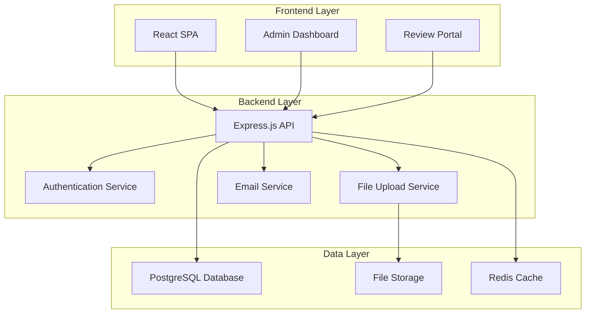

# Design Document

## Overview

The International Conference Website is a comprehensive web application that manages academic conference operations including participant registration, research submission workflows, manuscript review processes, and conference information dissemination. The system supports five academic sessions (CHE, CSE, BIO, MST, PFD) with both oral and poster presentation formats.

The architecture follows a modern web application pattern with a React-based frontend, Node.js/Express backend, PostgreSQL database, and file storage system for manuscript handling.

## Architecture

### System Architecture



### Technology Stack

**Frontend:**
- React 18 with TypeScript
- Material-UI for component library
- React Router for navigation
- React Query for state management and API calls
- React Hook Form for form handling
- Multi-step registration wizard for different participant types
- React Markdown Editor for abstract submission
- Markdown preview component for real-time rendering

**Backend:**
- Node.js with Express.js
- TypeScript for type safety
- JWT for authentication
- Multer for file uploads
- Nodemailer for email notifications
- bcrypt for password hashing
- marked.js for markdown processing
- puppeteer for PDF generation
- jsdom for HTML manipulation

**Database:**
- PostgreSQL for relational data
- Redis for session management and caching

**Infrastructure:**
- File storage (local filesystem or cloud storage)
- Environment-based configuration

## Components and Interfaces

### Core Components

#### 1. User Management System
- **UserController**: Handles registration, authentication, profile management
- **AuthMiddleware**: JWT token validation and role-based access control
- **UserService**: Business logic for user operations and participant type management
- **RegistrationService**: Handles different registration workflows based on participant type

#### 2. Conference Management System
- **ConferenceController**: Manages conference information, sessions, schedules
- **SessionService**: Handles academic session data and scheduling
- **ConferenceService**: General conference information management

#### 3. Submission Management System
- **SubmissionController**: Handles abstract and manuscript submissions
- **ReviewController**: Manages review assignments and feedback
- **SubmissionService**: Business logic for submission workflows
- **ReviewService**: Review process management
- **AbstractService**: Handles markdown processing and HTML rendering
- **AbstractBookService**: Generates compiled abstract books for admin

#### 4. File Management System
- **FileController**: Handles manuscript uploads and downloads
- **FileService**: File validation, storage, and retrieval
- **StorageAdapter**: Abstraction for different storage backends

#### 5. Payment Management System
- **PaymentController**: Handles payment submissions and verification
- **PaymentService**: Business logic for payment processing and verification
- **PaymentProofService**: Manages proof of payment file uploads and validation

### API Interfaces

#### Authentication Endpoints
```
POST /api/auth/register
POST /api/auth/login
POST /api/auth/logout
GET /api/auth/profile
PUT /api/auth/profile
GET /api/auth/participant-types
```

#### Conference Endpoints
```
GET /api/conference/info
GET /api/conference/sessions
GET /api/conference/schedule
POST /api/conference/register
```

#### Submission Endpoints
```
POST /api/submissions/abstract
POST /api/submissions/manuscript
GET /api/submissions/user/:userId
PUT /api/submissions/:id/status
```

#### Review Endpoints
```
GET /api/reviews/assigned/:reviewerId
POST /api/reviews/:submissionId
PUT /api/reviews/:reviewId
```

#### Payment Endpoints
```
GET /api/payments/user/:userId
POST /api/payments/submit-proof
GET /api/payments/proof/:paymentId
PUT /api/payments/:paymentId/status
```

#### Admin Endpoints
```
GET /api/admin/users
GET /api/admin/submissions
GET /api/admin/statistics
POST /api/admin/assign-reviewer
GET /api/admin/abstract-book/preview
POST /api/admin/abstract-book/generate
GET /api/admin/abstract-book/download/:format
GET /api/admin/payments/pending
PUT /api/admin/payments/:paymentId/verify
PUT /api/admin/payments/:paymentId/reject
```

## Data Models

### User Model
```typescript
interface User {
  id: string;
  email: string;
  password: string; // hashed
  firstName: string;
  lastName: string;
  affiliation: string;
  country: string;
  participantType: ParticipantType;
  role: UserRole;
  registrationDate: Date;
  selectedSessions: SessionType[];
  isActive: boolean;
  bio?: string;
  expertise?: string[];
  paymentStatus: PaymentStatus;
  registrationFee: number;
}

interface PaymentRecord {
  id: string;
  userId: string;
  amount: number;
  currency: string;
  paymentMethod: 'bank_transfer' | 'credit_card' | 'other';
  proofOfPaymentPath?: string; // File path for uploaded proof
  transactionReference?: string;
  paymentDate: Date;
  status: 'pending' | 'verified' | 'rejected';
  adminNotes?: string;
  verifiedBy?: string; // Admin user ID
  verificationDate?: Date;
}

type PaymentStatus = 'not_paid' | 'payment_submitted' | 'payment_verified' | 'payment_rejected';
```

type ParticipantType = 
  // Presenters/Speakers
  | 'keynote_speaker'
  | 'oral_presenter' 
  | 'poster_presenter'
  | 'panelist'
  | 'workshop_leader'
  // Attendees
  | 'regular_participant'
  | 'observer'
  | 'industry_representative'
  // Organizers
  | 'conference_chair'
  | 'scientific_committee'
  | 'organizing_committee'
  | 'session_chair'
  // Support Roles
  | 'reviewer'
  | 'technical_support'
  | 'volunteer'
  // Special Guests
  | 'sponsor'
  | 'government_representative';

type UserRole = 'participant' | 'presenter' | 'organizer' | 'reviewer' | 'admin';
```

### Submission Model
```typescript
interface Submission {
  id: string;
  userId: string;
  title: string;
  abstract: string; // Markdown format
  abstractHtml?: string; // Rendered HTML from markdown
  keywords: string[];
  sessionType: 'CHE' | 'CSE' | 'BIO' | 'MST' | 'PFD';
  presentationType: 'oral' | 'poster';
  status: 'submitted' | 'under_review' | 'accepted' | 'rejected';
  submissionDate: Date;
  manuscriptPath?: string;
  reviews: Review[];
  authors: Author[];
  correspondingAuthor: string;
}

interface Author {
  name: string;
  affiliation: string;
  email: string;
  isCorresponding: boolean;
}
```
```

### Review Model
```typescript
interface Review {
  id: string;
  submissionId: string;
  reviewerId: string;
  score: number; // 1-10 scale
  comments: string;
  recommendation: 'accept' | 'reject' | 'minor_revision' | 'major_revision';
  reviewDate: Date;
  isCompleted: boolean;
}
```

### Conference Model
```typescript
interface Conference {
  id: string;
  name: string;
  description: string;
  startDate: Date;
  endDate: Date;
  venue: string;
  registrationDeadline: Date;
  submissionDeadline: Date;
  sessions: Session[];
  registrationFees: RegistrationFee[];
  paymentInstructions: PaymentInstructions;
}

interface Session {
  id: string;
  type: 'CHE' | 'CSE' | 'BIO' | 'MST' | 'PFD';
  name: string;
  description: string;
  schedule: SessionSchedule[];
}

interface RegistrationFee {
  participantType: ParticipantType;
  earlyBirdFee: number;
  regularFee: number;
  lateFee: number;
  currency: string;
  earlyBirdDeadline: Date;
  lateRegistrationStart: Date;
}

interface PaymentInstructions {
  bankDetails: BankDetails;
  acceptedMethods: string[];
  instructions: string;
  supportContact: string;
}

interface BankDetails {
  bankName: string;
  accountName: string;
  accountNumber: string;
  swiftCode?: string;
  routingNumber?: string;
}
```

## Error Handling

### Error Response Format
```typescript
interface ErrorResponse {
  success: false;
  error: {
    code: string;
    message: string;
    details?: any;
  };
  timestamp: string;
}
```

### Error Categories
1. **Validation Errors** (400): Invalid input data, missing required fields
2. **Authentication Errors** (401): Invalid credentials, expired tokens
3. **Authorization Errors** (403): Insufficient permissions
4. **Not Found Errors** (404): Resource not found
5. **File Upload Errors** (413): File too large, invalid format
6. **Server Errors** (500): Database errors, external service failures

### Error Handling Strategy
- Global error middleware for consistent error responses
- Input validation using Joi or similar library
- File upload validation (size, format, virus scanning)
- Database transaction rollback on errors
- Logging of all errors for monitoring

## Testing Strategy

### Unit Testing
- **Backend**: Jest for API endpoints, services, and utilities
- **Frontend**: Jest + React Testing Library for components
- **Database**: In-memory database for isolated tests
- **File Operations**: Mock file system operations

### Integration Testing
- API endpoint testing with supertest
- Database integration tests with test database
- File upload/download workflow testing
- Email service integration testing

### End-to-End Testing
- Cypress for complete user workflows
- Registration and submission processes
- Review workflow testing
- Admin panel functionality

### Test Coverage Goals
- Minimum 80% code coverage for backend services
- 70% coverage for frontend components
- 100% coverage for critical paths (authentication, submissions, reviews)

### Testing Data
- Seed data for different user roles
- Sample submissions for each session type
- Test manuscripts and files
- Mock email templates and configurations

## Security Considerations

### Authentication & Authorization
- JWT tokens with appropriate expiration
- Role-based access control (RBAC)
- Password strength requirements
- Account lockout after failed attempts

### Data Protection
- Input sanitization and validation
- SQL injection prevention with parameterized queries
- XSS protection with content security policy
- File upload security (type validation, virus scanning)

### Infrastructure Security
- HTTPS enforcement
- Environment variable management
- Database connection security
- Rate limiting for API endpoints

## Performance Considerations

### Caching Strategy
- Redis for session data and frequently accessed conference information
- API response caching for static data
- File metadata caching

### Database Optimization
- Proper indexing on frequently queried fields
- Connection pooling
- Query optimization for large datasets

### File Handling
- Streaming for large file uploads/downloads
- File compression for storage efficiency
- CDN integration for static assets

## Deployment Architecture

### Environment Configuration
- Development, staging, and production environments
- Environment-specific database configurations
- Feature flags for gradual rollouts

### Scalability Considerations
- Horizontal scaling capability for API servers
- Database read replicas for improved performance
- File storage scaling (local to cloud migration path)
- Load balancing for high availability